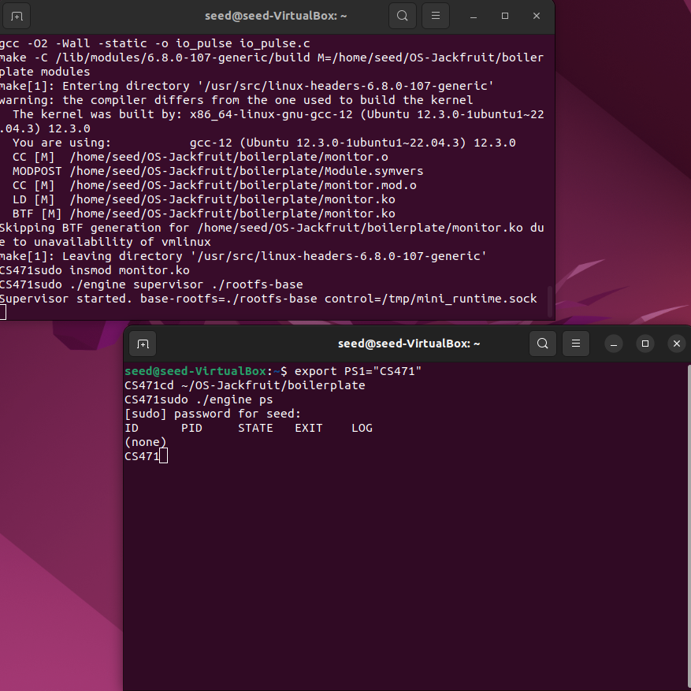
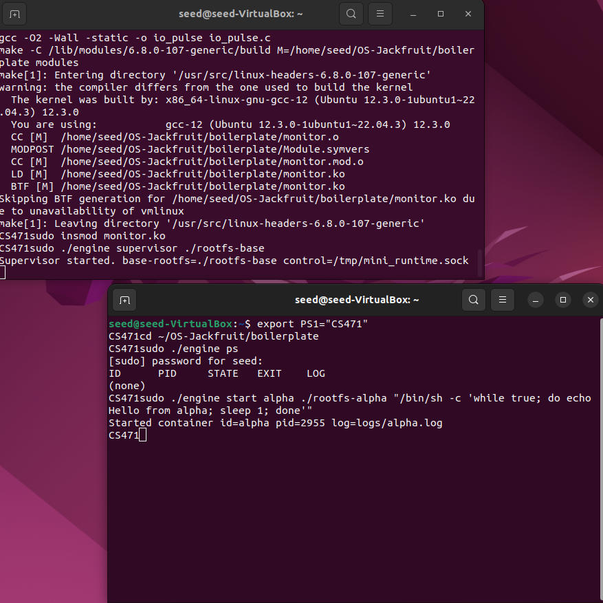
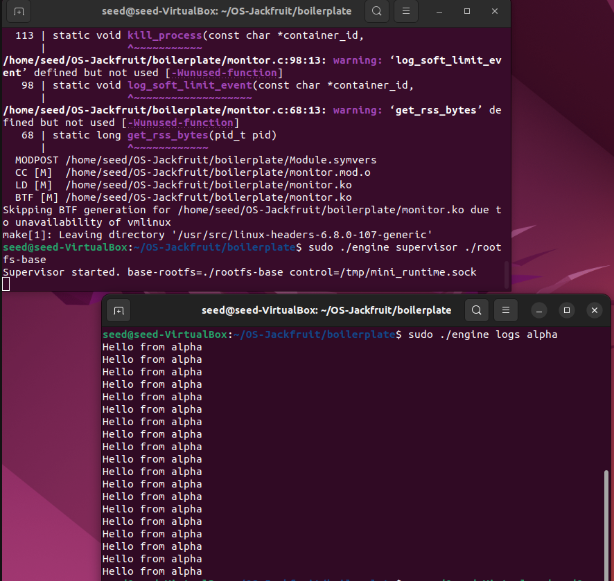
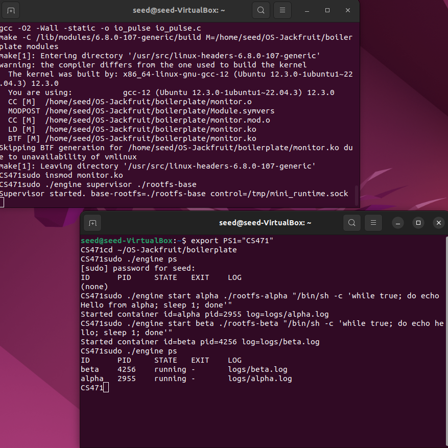
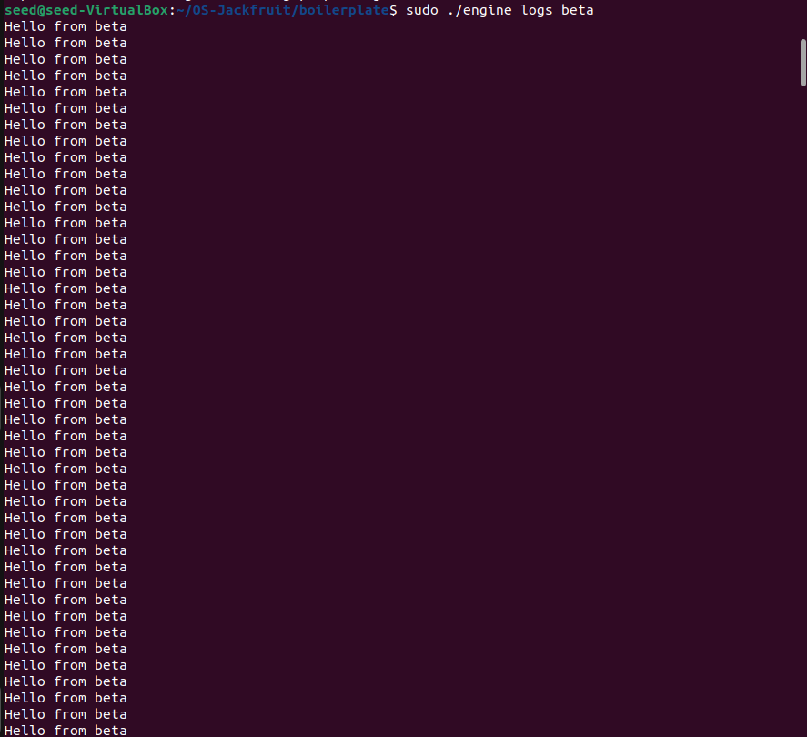
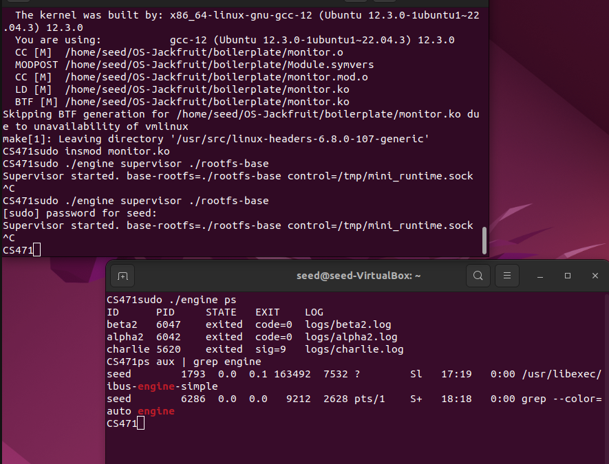
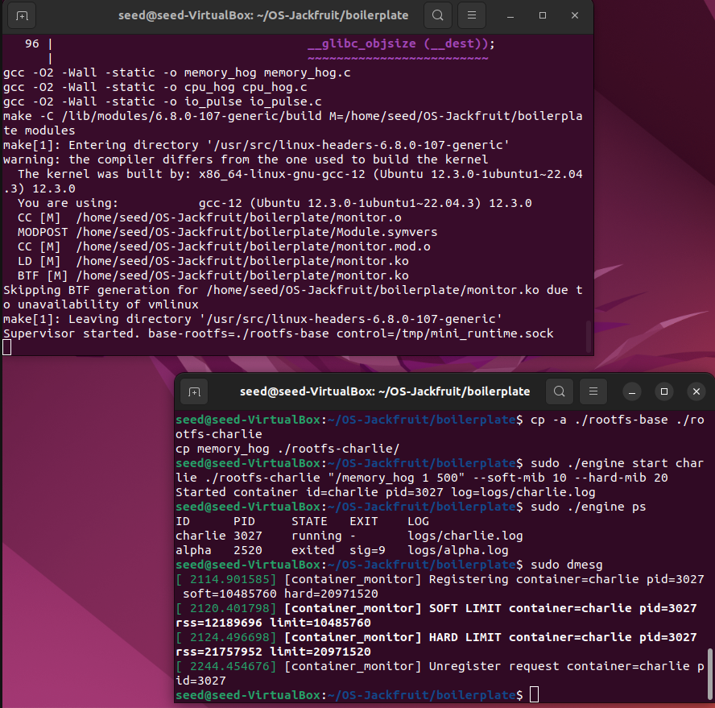
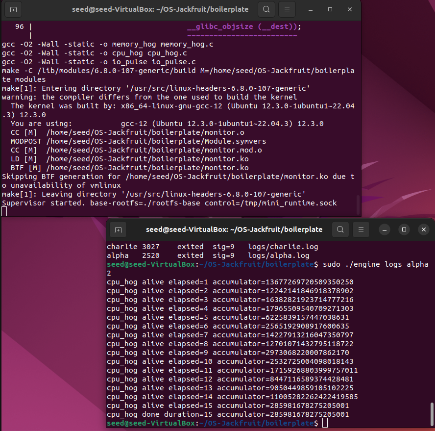
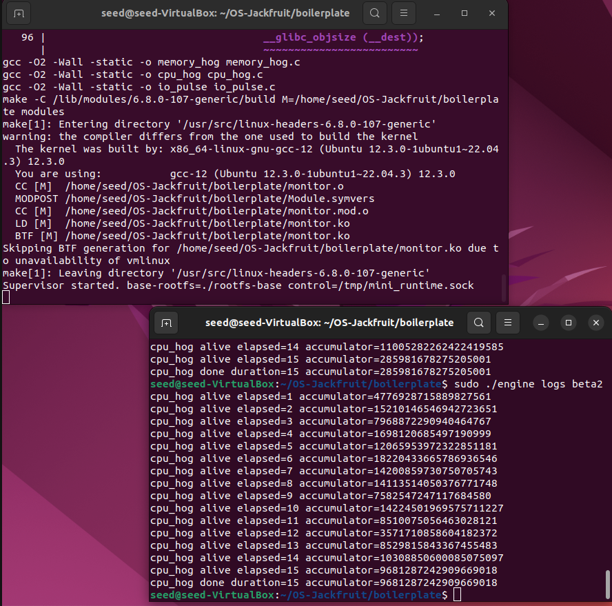

# Multi-Container Runtime

**Team Members:**
* Srivani Karanth - SRN: PES1UG24CS471
* Shriya K - SRN: PES1UG24CS448

---

## Build, Load, and Run Instructions

Follow these steps to build the runtime, load the kernel monitor, and start managing containers from a fresh Ubuntu VM environment.

### 1. Clean and Build the Project
```bash
cd ~/OS-Jackfruit/boilerplate
sudo make clean
make
```

### 2. Load the Kernel Module
```bash
sudo insmod monitor.ko
```

### 3. Prepare the Root Filesystems
```bash
# Verify base-rootfs is extracted
mkdir -p rootfs-base
wget -nc [https://dl-cdn.alpinelinux.org/alpine/v3.20/releases/x86_64/alpine-minirootfs-3.20.3-x86_64.tar.gz](https://dl-cdn.alpinelinux.org/alpine/v3.20/releases/x86_64/alpine-minirootfs-3.20.3-x86_64.tar.gz)
tar -xzf alpine-minirootfs-3.20.3-x86_64.tar.gz -C rootfs-base

# Create writable copies
rm -rf rootfs-alpha rootfs-beta
cp -a ./rootfs-base ./rootfs-alpha
cp -a ./rootfs-base ./rootfs-beta
```

### 4. Start the Supervisor
Start the long-running supervisor daemon in Terminal 1:
```bash
sudo ./engine supervisor ./rootfs-base
```

---

## Demo Screenshots

### Milestone 1: Metadata Tracking & Supervisor Initialization


*Displays the initial supervisor startup and the empty metadata table, verifying the control-plane socket is listening.*

<br>

### Milestone 2: CLI and IPC Communication


*Demonstrates the CLI sending a 'start' request and the supervisor successfully cloning the 'alpha' process.*

<br>

### Milestone 3: Initial Output Redirection (Basic Pipes)


*Early verification stage: Proving that stdout can be captured from an isolated container before implementing the full buffer.*

<br>

### Milestone 4: Multi-Container Supervision


*Verification of isolation: Multiple containers (alpha and beta) running concurrently, each tracked with its own host PID.*

<br>

### Milestone 5: Bounded-Buffer Logging (Thread Synchronization)


*Advanced Logging: Demonstrating the thread-safe producer-consumer pipeline using mutexes and condition variables to stream logs.*

<br>

### Milestone 6: Clean Teardown


*Lifecycle Management: Stopping containers via IPC and verifying that the supervisor reaps them, updating state to 'running' or 'exited'.*

<br>

### Milestone 7: Memory Limit Enforcement (Soft/Hard)


*Resource Control: Kernel logs showing the monitor LKM detecting a soft-limit breach and enforcing a hard-limit via SIGKILL.*

<br>

### Milestone 8: Scheduler Nice Experiment




*Scheduling: Proving that 'alpha2' (nice 0) accumulates more CPU cycles than 'beta2' (nice 19) over the same time period.*

<br>

---

## Engineering Analysis

**1. Isolation Mechanisms**
The runtime achieves isolation using Linux namespaces and `chroot`. `CLONE_NEWPID` provides a private process tree, while `CLONE_NEWUTS` isolates the hostname. `chroot` locks the process into the Alpine root filesystem, ensuring it cannot access host files. 

**2. Supervisor Lifecycle**
The supervisor daemon manages the entire lifecycle of the containers. It uses `waitpid` with the `WNOHANG` flag to asynchronously reap exited child processes, maintaining system stability and preventing resource leaks.

**3. IPC and Synchronization**
- **Control Plane:** Uses UNIX Domain Sockets for low-latency communication between the CLI and the daemon.
- **Data Plane:** Container logs are piped into a bounded buffer. Thread safety is ensured using `pthread_mutex_t` and condition variables (`not_full`/`not_empty`) to manage the producer-consumer relationship.

**4. Memory Monitoring**
Implemented as a Linux Kernel Module (LKM) for accuracy. It uses `get_mm_rss` to track the Resident Set Size. Hard limits are strictly enforced via `SIGKILL` sent directly from the kernel to the offending process. 

**5. Scheduling Behavior**
The experiment confirms that the Linux Completely Fair Scheduler (CFS) respects `nice` values. Processes with higher priority (lower nice) receive a larger proportion of CPU time-slices, as seen in the higher accumulator values for the `alpha2` container.

---

## Design Decisions

* **Spinlock over Mutex:** Used in the kernel monitor because the list is traversed in a timer interrupt context where the kernel cannot sleep.
* **Bounded Buffer:** Used to decouple container execution from disk I/O latency, preventing a slow disk write from blocking the containerized application.
* **Static Linking:** Workload binaries (cpu_hog, memory_hog) are statically linked to ensure they run correctly within the isolated root filesystem without external dependencies.

---

## Key Learnings & Challenges

* **Concurrency is Hard:** One of the biggest challenges was handling the producer-consumer relationship for logging. We initially faced deadlocks when the buffer was full, which was resolved by correctly implementing `pthread_cond_broadcast` to wake up the consumer thread.
* **The Kernel doesn't Sleep:** While implementing the memory monitor, we learned that inside a timer interrupt; you cannot use semaphores or mutexes that might sleep and using a `spinlock` was essential for system stability.
* **Namespace Nuances:** We discovered that while namespaces provide process and hostname isolation, they don't automatically isolate the filesystem - `chroot` is required to finalize the "container" feel.
* **Race Conditions:** We encountered a race condition where the hard limit was hit before the soft limit could be logged. This taught us the importance of choosing appropriate polling intervals and workload speeds for monitoring systems.
